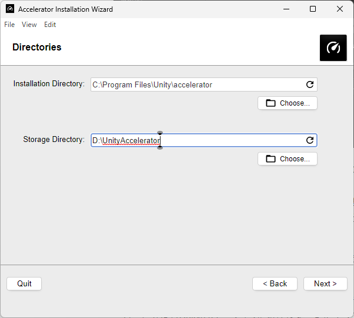
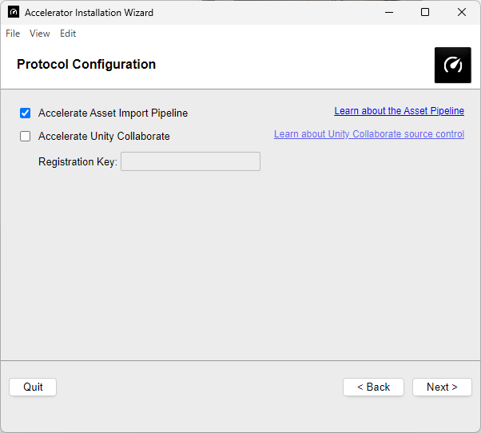
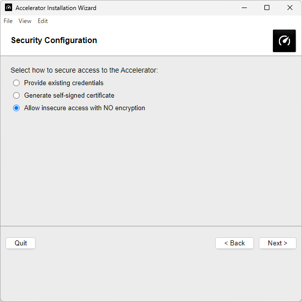
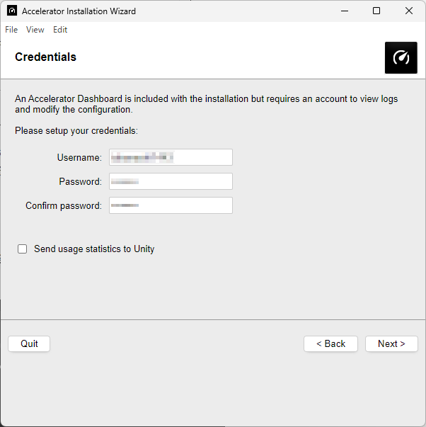
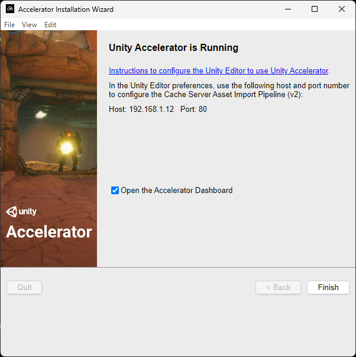
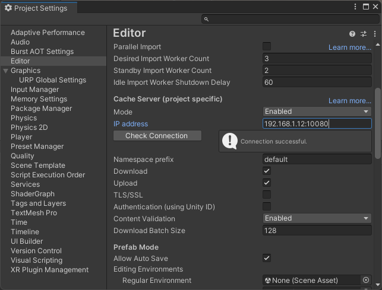
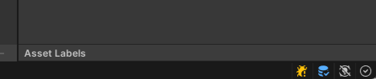

# Unity Accelerator

## インストール(初回)

- Installation Directory -> プログラムを置く場所。Program Filesのままで良い
- Storage Directory -> データを置く場所。SSDの分かりやすい場所。ここではD://UnityAccelerator

- Accelerate Unity Collaborateは外す

- 個人開発でサーバとして使わない場合は「Allow Insecure access with NO encryption」で良い

- UsernameとPassword。普段は自動ログインなので忘れがち。メモっておく。

最後にサーバーのIPアドレスが出るので控えておく。
自分の場合は192.168.1.12:10080にアクセスするとダッシュボードが見られる。

## プロジェクトへの導入

CompanyNameとProductNameを最初に変えた方が良さそうな気がする。

Project Settings -> Editor -> Cache Serverと進み、

- Modeを「Enabled」
- IP addressを先程のアドレス

- 接続するとUnityEditorの右下にDBっぽいアイコンが出る

何かしらのアセットをインポートした時にDownload into Cacheの数値が増えていればOK

## 備考
Unity 2019.3からアセットのインポート周りがAsset Pipeline2という仕組みに変わり、
これまでローカルキャッシュサーバーという仕組みがあったのが無くなり、代わりにUnity Acceleratorを使うようになった。

## 参考リンク
- [【Unity】Unity Accelerator の基本的な使い方](https://baba-s.hatenablog.com/entry/2020/09/14/090000)
これが一番詳しかった。
- [Unity 2019.3以降のアセットインポートをUnity Acceleratorで速くする](https://korinvr.com/blog/2020/02/09/)
- [Unity開発を高速・快適にするためのメモ](https://tech.framesynthesis.co.jp/unity/qol/)
