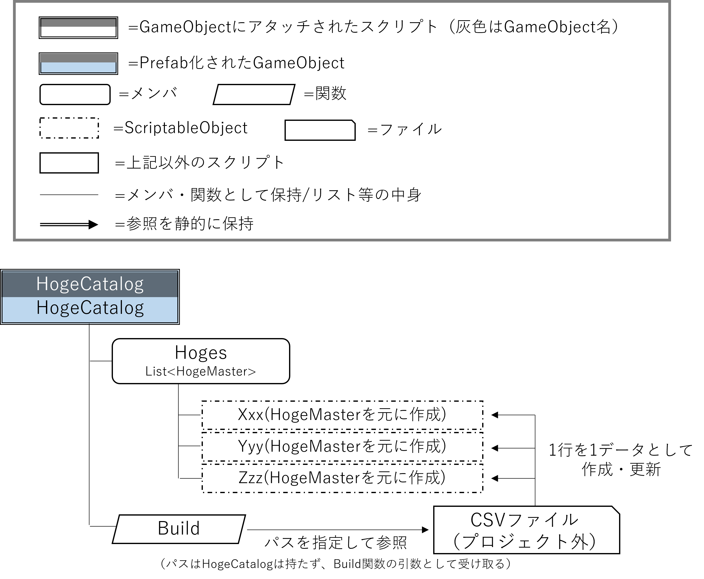
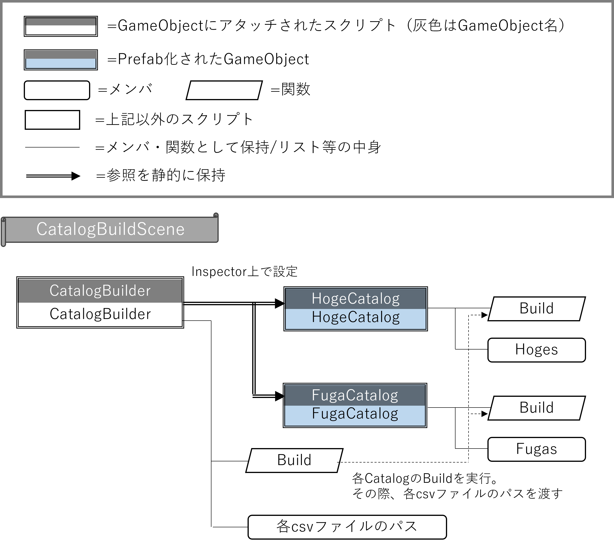
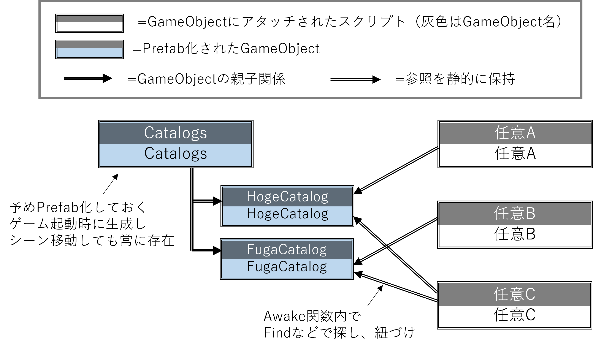

# CSVとScriptableObjectによるデータベース

様々なゲームで、ローカルで固定のデータベースを持たせたいことがある。
例えば、RPGにおける敵キャラのデータベース、リズムゲームにおける楽曲情報のデータベース、カードゲームにおける、カード名、画像（への参照）、効果など……。

また、これらのデータベースは相互に連携する場合がある。
例えば、敵キャラがアイテムをドロップする時、アイテムのデータベースを参照して指定するなど……。

少数のデータならアセットで作成したり、定数配列にしたりしても良いが、RPGにおけるアイテムなどはこのような方法を取ることは難しい。

そのようなデータベースを、CSVとScriptableObjectを使ったデータベースを使って実現する。

## 用語

まず、この方法で作成するデータベースにおいて以下の用語を限定使用する。

`Master`

:   マスタデータとなるScriptableObjectクラス。
    アイテム1件、敵キャラ1件など、データベースにおけるレコード1件を指す。

`Catalog`

:   単一種類のマスタデータをリストなどの形で保持するGameObjectクラス。
    また、CSVファイルからマスタデータを作成する関数「Build」を持つ。

## 要件・設計（基本編）

この仕組みは、下記のような要件を実現できるように設計される。

### CatalogはMasterのリストを保持し、またそれをcsvファイルから形成できる



### 各CatalogはCatalogBuilderによってビルドされる



### Catalogsはゲーム起動時に生成され、各シーンのGameObjectから参照される



### 要件の整理・補足

- Catalogは自身のCSVファイルへのパスを持たない。
- CatalogBuilderはCSVファイルへのパスを持つ。CatalogBuilderシーンで各Catalogプレハブの中身を更新するのに使用され、ゲームには含まれない。

## 実装（基本編）

### ゲーム起動時にCatalogsを生成する

### 各Catalogをビルドするクラスを作る


## Tips

### 画像(Sprite)などをScriptableObjectに含めたい場合

先に画像(Sprite)などを登録しておき、そのGUIDで紐づける。

たとえばSprite画像をScriptableObjectに含めたい場合のスクリプト。
thumb_idがSpriteのGUID、mがメモリに展開中のScriptableObject、thumbnailがSpriteを紐づけるメンバであるとする。

```

// GUIDをSpriteに変換
if (!string.IsNullOrEmpty(thumb_id))
{
    string path = AssetDatabase.GUIDToAssetPath(thumb_id);
    if (!string.IsNullOrEmpty(path))
    {
        m.thumbnail = AssetDatabase.LoadAssetAtPath<Sprite>(path);
    }
    else
    {
        UnityEngine.Debug.LogWarning($"GUID:{thumb_id} のスプライトが見つかりませんでした");
        m.thumbnail = null;
    }
}

```

### さらに、1つのアセットから複数のSpriteを生成している場合

SpriteのGUIDと、Spriteの名前で紐づける。
guidがSpriteのGUID、spriteNameがSpriteの名前である場合。resultが返されるSpriteとなる。

```

string path = AssetDatabase.GUIDToAssetPath(guid);
if (!string.IsNullOrEmpty(path))
{
    // 複数のSprite（サブアセット）を取得
    Object[] assets = AssetDatabase.LoadAllAssetRepresentationsAtPath(path);
    foreach (Object obj in assets)
    {
        if (obj is Sprite sprite && sprite.name == spriteName)
        {
            result = sprite;
            return;
        }
    }

    Debug.LogWarning($"GUID:{guid} のスプライトシート内に '{spriteName}' という名前のスプライトが見つかりませんでした");
}
else
{
    Debug.LogWarning($"GUID:{guid} のアセットが見つかりませんでした");
}

```

## 参考サイト

- [【備忘録】ScriptableObjectとCSVの連携・「転生女騎士、アパートに住む【放置ゲーム】」の作り方（3）【Unity】](https://note.com/yamasho55/n/n04bd2f6d136d)
- [【Unity】ゲーム中に常時必要なGameObjectがどのシーンから始めても存在するようにしてみよう](https://www.urablog.xyz/entry/2018/02/11/164734)