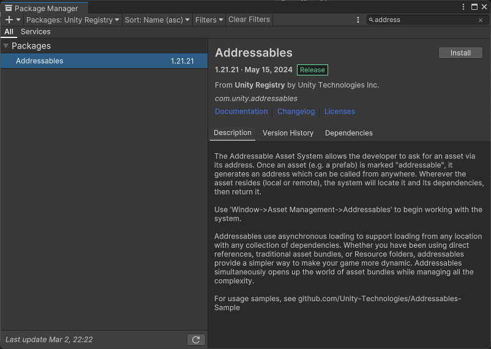

# Addressables

## インストール

Package Managerからインストールする。

## 使い方

### あるアセットをAddressableで呼び出せるようにする

Addressablesをインストールしていると、InspectorビューにAddressableのチェックマークがつく。

チェックマークをつけてパスを入力するとそのパスで呼び出せるようになる。

### 実際に呼び出す(基本編)

非同期（ロードしている間に処理を進める）ロードの例。

- [【Unity】僕はそろそろResourcesフォルダを卒業しようと思う](https://light11.hatenadiary.com/entry/2020/07/29/202755)

同期（ロード完了まで待つ）ロードの例。

- [【Unity】Addressableアセットシステムで同期ロードが公式サポート、Resources.Loadを置き換え可能に](https://light11.hatenadiary.com/entry/2021/04/13/194929)

### ビルドして使えるか確認する

実機で使用するには、Addressableをビルドする必要がある。

Addressable Asset SettingsのBuild Addressables content on Player Buildにチェックを入れればプレイヤービルド時にAddressblesもビルドされる。

## どこで利用するか

[`CSVとScriptableObjectによるデータベース`](../basic_design/csv_so_database.md)

:   RuntimeInitializeOnLoadMethodでCatalogsをゲーム上に生成したい時、そのアドレスをAddressablesで指定して生成する。

## 参考サイト

- [【前編】UnityのAddressableを個人制作で使いこなす](https://orotiyamatano.hatenablog.com/entry/Addressabes1)
- [【Unity】Unityで多言語化（Localization)に対応する](https://robotcoders.net/2022/03/unitylocalization)
- [シーンの切り替えで引数を文字列にしなくてもいい方法](https://soft-rime.com/post-5778/)
