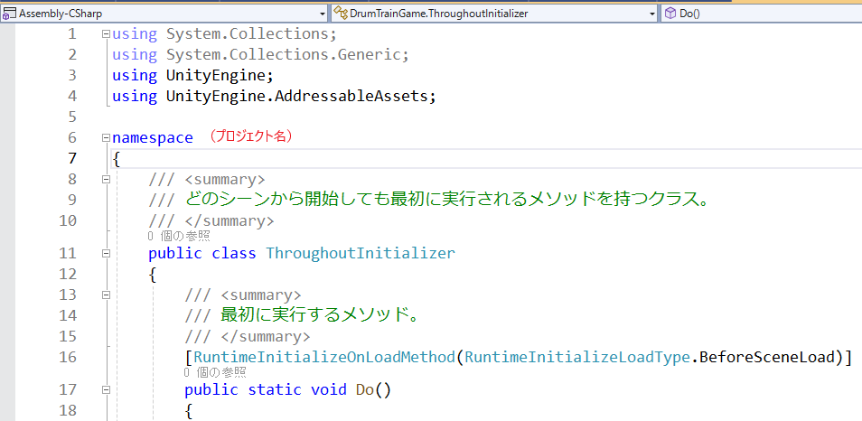

# RuntimeInitializeOnLoadMethod

## RuntimeInitializeOnLoadMethodとは

MonoBehaviourを継承しないクラスを作成し、そのメソッドに「RuntimeInitializeOnLoadMethod」属性をつけるとゲーム起動時にその関数が実行されるようになる。

シーン上に配置されていなくても実行される。

## 基本デザインと主な実行内容

### 定義部分

(ProjectName)/Scripts/Specialフォルダ内に「ThroughoutInitializer」という名前のスクリプトを作成し、「Do」という関数に対して「RuntimeInitializeOnLoadMethod(RuntimeInitializeLoadType.BeforeSceneLoad)」属性を付与する。

（忘れづらいように名前は上の内容で固定）

### 固定のデータベースの読み込み

詳細は[このページ](./../basic_design/csv_so_database.md)を参照。

### 共通のセーブデータの読み込み

詳細は[このページ](./../basic_design/save.md)を参照。

## Tips

## 参考ページ

- 