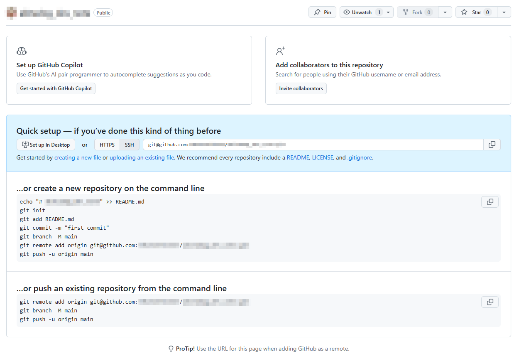

# Git

このドキュメントは、下記の方法によりGitHub Pagesで公開している。

## ローカルリポジトリを作成し、リモートリポジトリにpushする

### 手順

#### ローカルリポジトリ作成、内容のコミット

ルートフォルダ内で

```
git init
```

でリモートリポジトリを作成。

```
git add -A
git commit -m "comment"
```

で内容をコミットする。

#### SSH鍵を作る

SSH鍵は通常、

```
C:\Users(ユーザー)\(ユーザ名)\.ssh
```

内に作成する。

作成中。

#### リモートリポジトリを作成とpush

GitHubにログインし、右上の「＋」から「Create New Repository」



リポジトリ作成時に出てくるガイダンスに従って、

```
git remote add origin git@github.com:XXXX/XXXX.git
git branch -M main
git push -u origin main
```

でリモートリポジトリにpushできる。
originはリモートとの関連付けの名前で、他の名前でも良い。


## Github Pagesで公開する

Github Pagesはルートかdocsフォルダしか公開対象に選べないため、
mkdocsのMarkdownファイル群を入れるフォルダをMarkdownsにし、
buildで出力するフォルダをdocsにした。

## トラブルシューティング

`git remoteの設定を間違えた`

:   rm(remote, 削除)により削除する。

```
git remote -v           # 情報を表示
git remote rm origin
```

`git管理されたくないファイルがGit管理されてしまった`

:   .gitignoreを削除するだけでは反映されず、一旦キャッシュを削除する必要がある。
    .gitignoreを編集したのち、下記コマンドでaddし直す。

```
git rm -r --cached .    # ファイル全体キャッシュ削除
git add -A              # 改めて全ファイルを管理に入れ直す(gitignoreの指定は反映される)
git ls-files -oi --exclude-standard     # 管理外のファイルを確認できる
```


### 参考ページ

- [【 GitHub 】ローカル作成したリポジトリをリモートに「Push」するまで！](https://qiita.com/Futo_Horio/items/4d669f695680bc13d5fa)

## MkDocsで作ったページをGitHub Pagesで公開する

### 手順

### 参考ページ

- [GitHub PagesをMKDocsで作ってみた](https://enu23456.hatenablog.com/entry/2022/11/11/192039)
- [mkdocs-materialとGitHub PagesでMkDocsを作成する](https://qiita.com/nakamasato/items/80da609439cbcce57678)
- [mkdocsを使ったGitHub Pagesの作成方法](https://aiedoc.github.io/note/Tips/Mkdocs/mkdocs%E3%82%92%E4%BD%BF%E3%81%A3%E3%81%9FGitHubPages/)
- [【初心者向け】【入門】GitHub Actionsとは？](https://qiita.com/shun198/items/14cdba2d8e58ab96cf95)


## 基本操作

`git init`

:   フォルダをGit管理に対応させる。

```
git init
```